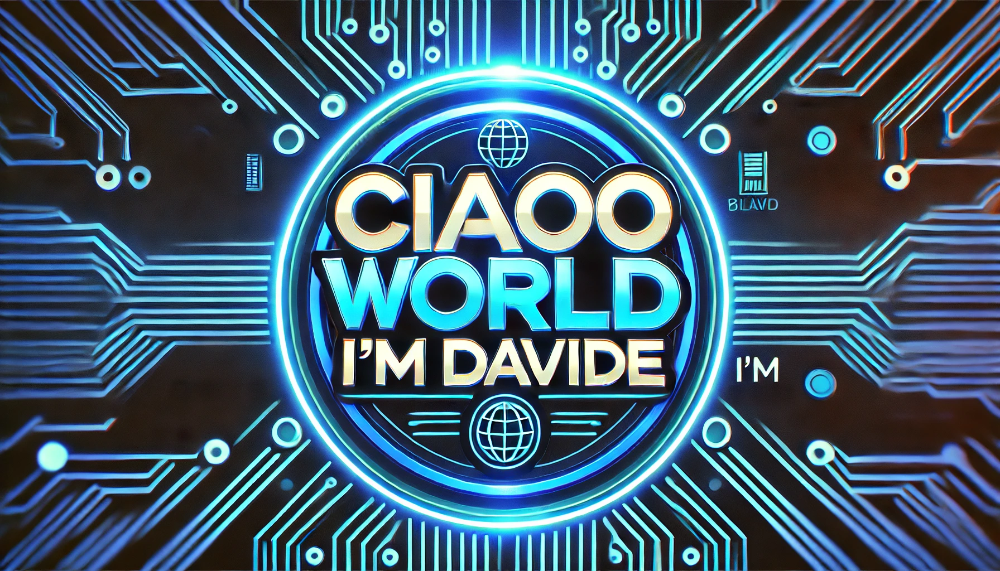

  

# 💫 About Me:

🎓I'm currently studying at Technical University of Cluj-Napoca(computer engineering). Who needs sleep when there are algorithms to conquer?

## 🌐 Socials:

 

# 💻 Tech Stack:

           

# 📊 GitHub Stats:

 

### 🔝 Top Contributed Repo

<picture>
  <source media="(prefers-color-scheme: dark)" srcset="https://raw.githubusercontent.com/davideboss2003/davideboss2003/output/github-snake-dark.svg" />
  <source media="(prefers-color-scheme: light)" srcset="https://raw.githubusercontent.com/davideboss2003/davideboss2003/output/github-snake.svg" />
  
</picture>
